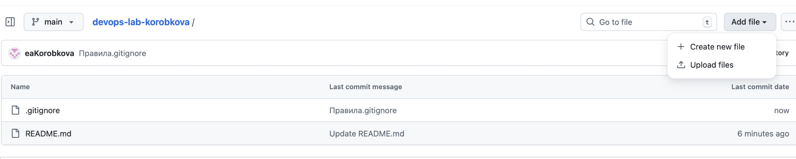
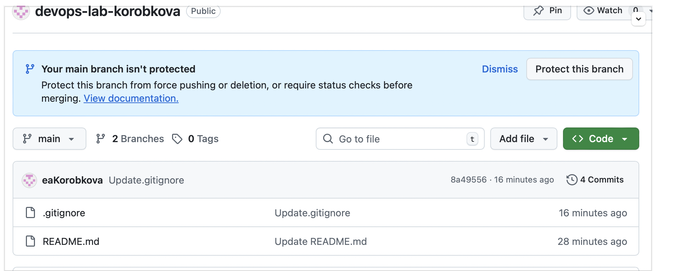
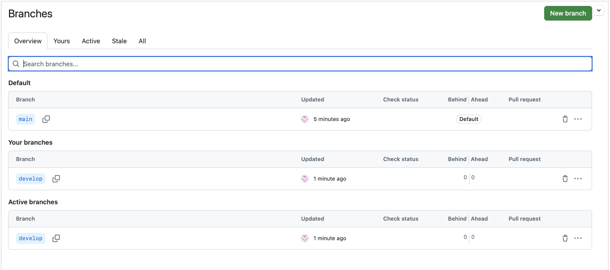
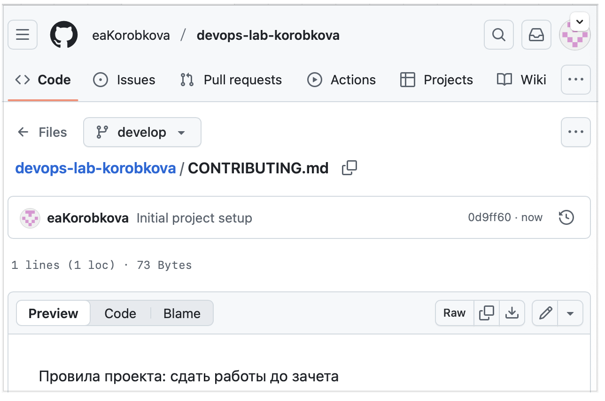
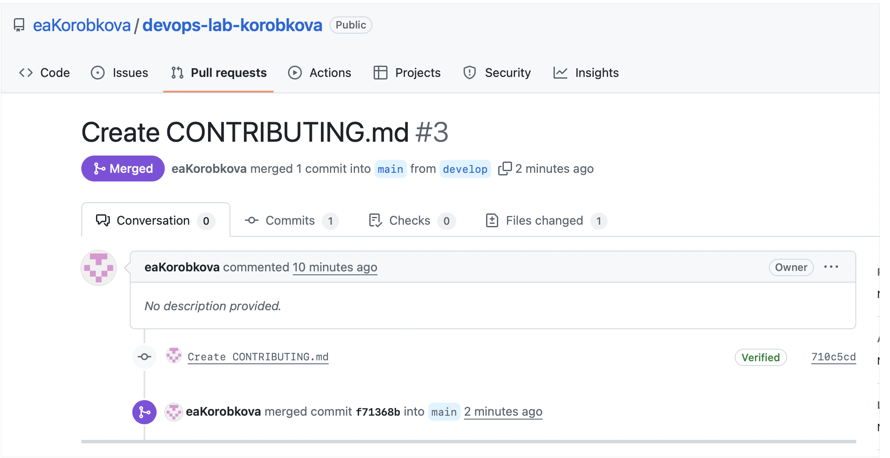

University: ITMO University

Faculty: FICT

Course: Cloud platforms as the basis of technology entrepreneurship ADD link

Year: 2025/2026

Group: U4225

Author: KOROBKOVA EKATERINA ANDREEVNA

Lab: Lab0

Date of create: 29.09.2025

Date of finished: 30.09.2025

Создала новый репозиторий, нажала «NEW»

Создаю файлы через «ADD file»

Создала новую ветку

Создала  файл CONTRIBUTING.md с правилами участия в проекте и сделайте коммит с сообщением "Initial project setup" и отправьте изменения в удаленный репозиторий.

Нажала «PULL requests» из ветки develop

создала pull request

Смержила во вкладке Pull Request


Удалила ветку

