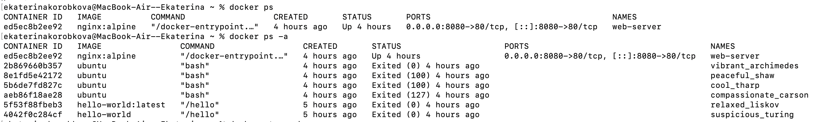
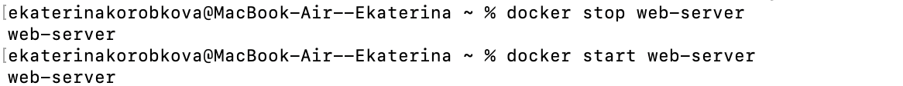
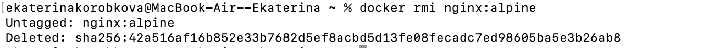

Обычная лабораторная работа

**Установка Docker**

1.1. Установила Docker Desktop
   
1.2. Проверила установку командой docker --version

1.3. Запустила тестовый контейнер: docker run hello-world

1.4. Изучила базовые команды: docker images, docker ps, docker ps -a

**2. Работа с готовыми образами**

2.1. Скачала образ Ubuntu: docker pull ubuntu:latest

2.2. Запустила интерактивный контейнер: docker run -it ubuntu bash и установила пакет curl: apt update && apt install -y curl

 

2.3. Проверила установку: curl --version и вышла из контейнера: exit

 

**3. Запуск веб-сервера**

3.1. Запустила контейнер с nginx: docker run -d -p 8080:80 --name web-server nginx:alpine

3.2. Проверить работу в браузере: http://localhost:8080

3.3. Посмотрела логи контейнера: docker logs web-server

 

3.4. Подключилась к контейнеру: docker exec -it web-server sh

**4. Управление контейнерами**

4.1. Посмотрела запущенные контейнеры: docker ps и все контейнеры: docker ps -a

4.2. Остановила контейнер: docker stop web-server и запустила остановленный контейнер: docker start web-server

4.3. Удалила контейнер: docker rm web-server

4.4. Удалила образ: docker rmi nginx:alpine

**5. Работа с томами (volumes)**

5.1. Создала том: docker volume create my-volume

5.2. Запустить контейнер с томом: docker run -d -v my-volume:/data --name volume-test ubuntu

5.3. Подключиться к контейнеру: docker exec -it volume-test bash и создала файл в томе: echo "Hello from volume" > /data/test.txt

5.4. Удалилаа контейнер и создать новый с тем же томом
