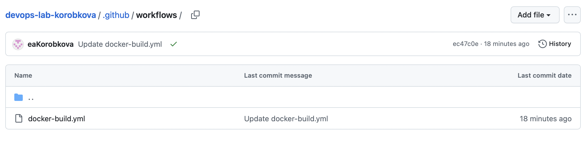

University: ITMO University

Faculty: FICT

Course: Cloud platforms as the basis of technology entrepreneurship ADD link

Year: 2025/2026

Group: U4225

Author: KOROBKOVA EKATERINA ANDREEVNA

Lab: Lab2

Date of create: 05.09.2025

Date of finished: 06.10.2025

Обычная лабораторная работа

Настройка CI/CD пайплайна с GitHub Actions:

**1. Подготовка проекта**

Создала аккаунт на Docker Hub и создать новый репозиторий ict на Docker Hub

** 2. Настройка GitHub Actions**
Создать папку .github/workflows/ в корне проекта

Создать файл docker-build.yml с пайплайном:

** 3. Настройка секретов**

В настройках GitHub репозитория добавила секреты:

** 4. Тестирование пайплайна**

Проверила выполнение пайплайна в разделе Actions

Убедилась, что образ появился в Docker Hub

