University: ITMO University
Faculty: FICT

Course: Cloud platforms as the basis of technology entrepreneurship ADD link

Year: 2025/2026

Group: U4225

Author: KOROBKOVA EKATERINA ANDREEVNA

Lab: Lab3

Date of create: 09.10.2025

Date of finished: 10.10.2025

Обычная лабораторная работа

**1. Создание конфигурации Prometheus**

Создала папку prometheus для конфигурации и файл prometheus/prometheus.yml со следующим содержимым

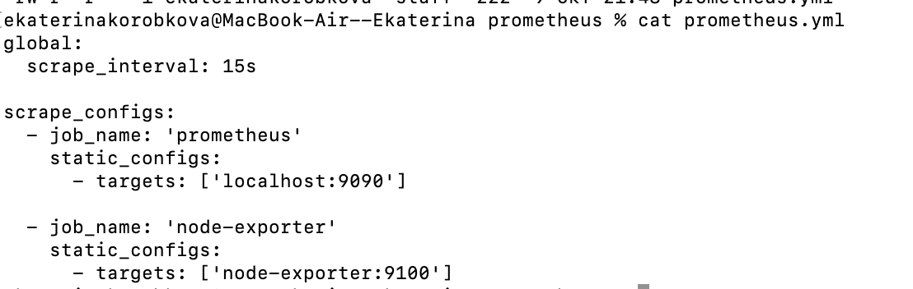

**2. Запуск Node Exporter**

Запустила контейнер Node Exporter для сбора системных метрик

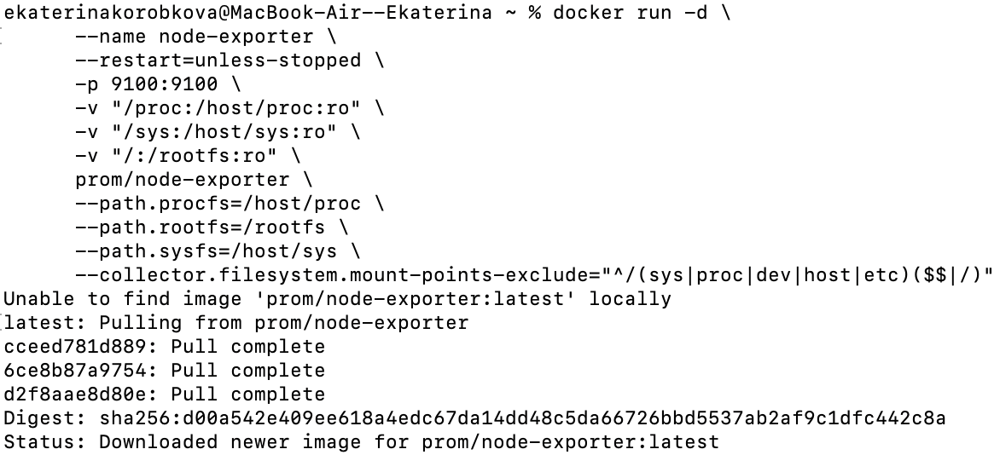

Проверила работу http://localhost:9100/metrics

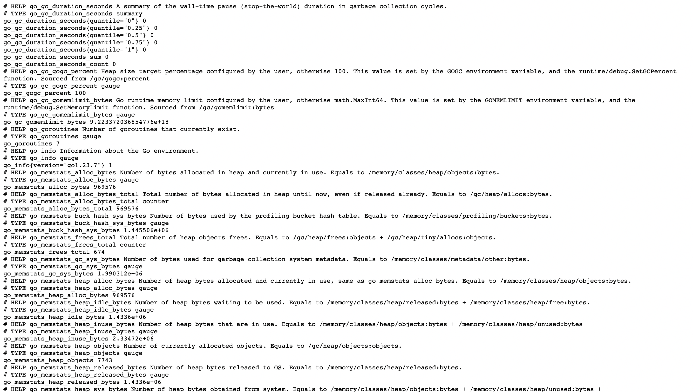

**3. Запуск Prometheus**

Создала том для данных Prometheus и запустила контейнер Prometheus:

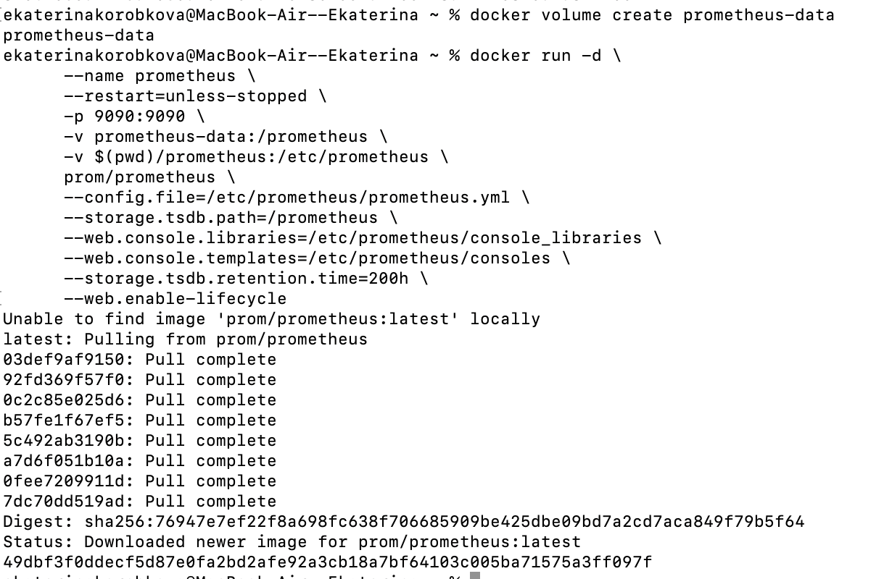

Проверила работу http://localhost:9090

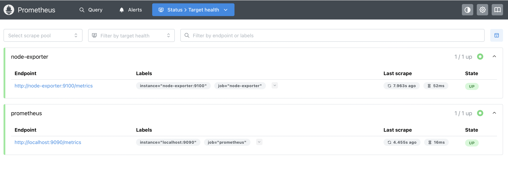

**4. Запуск Grafana**

Создала том для данных Grafana и запустила контейнер Grafana

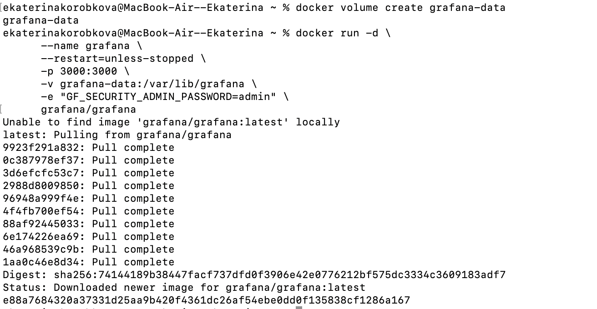

Проверила работу http://localhost:3000

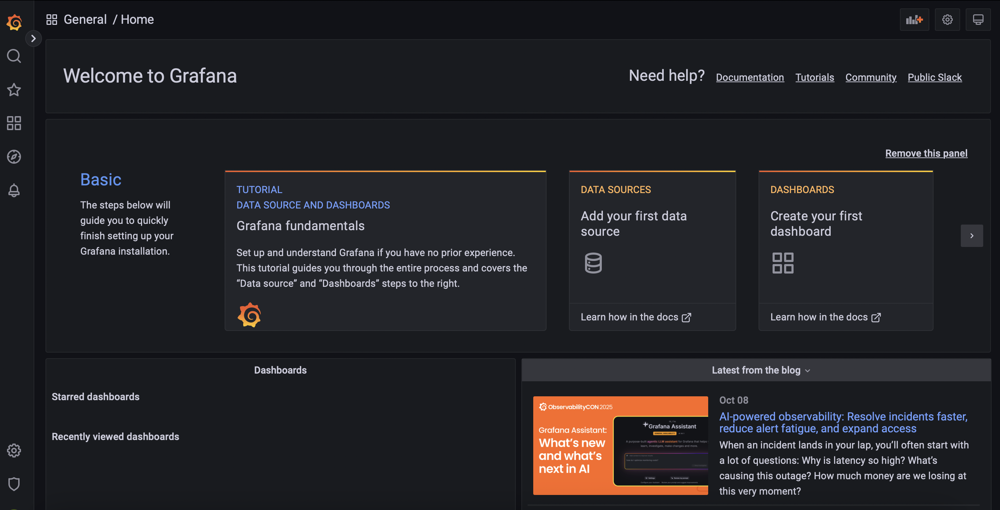

**5. Настройка Grafana**

Вошла в Grafana (admin/admin)], добавила источник данных Prometheus, URL: http://prometheus:9090

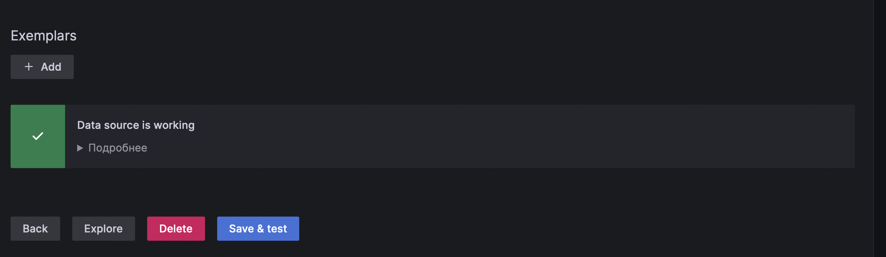

Создала дашборд: источник данных Prometheus, метрика: node_cpu_seconds_total

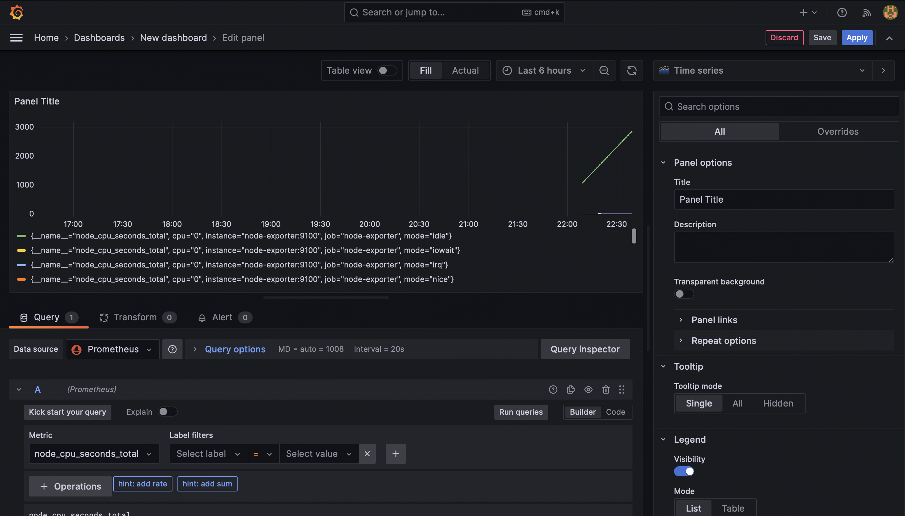

**6. Тестирование системы**

Проверила все контейнеры: docker ps

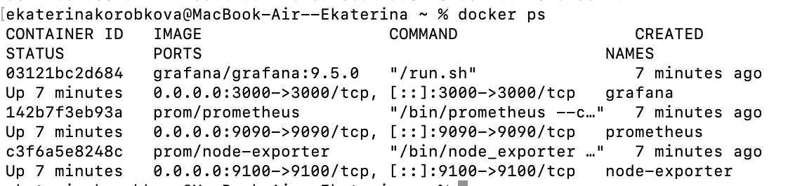

Открыла Prometheus и убедилась, что метрики собираются

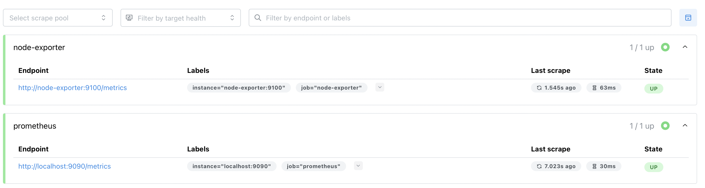

Создала график для CPU

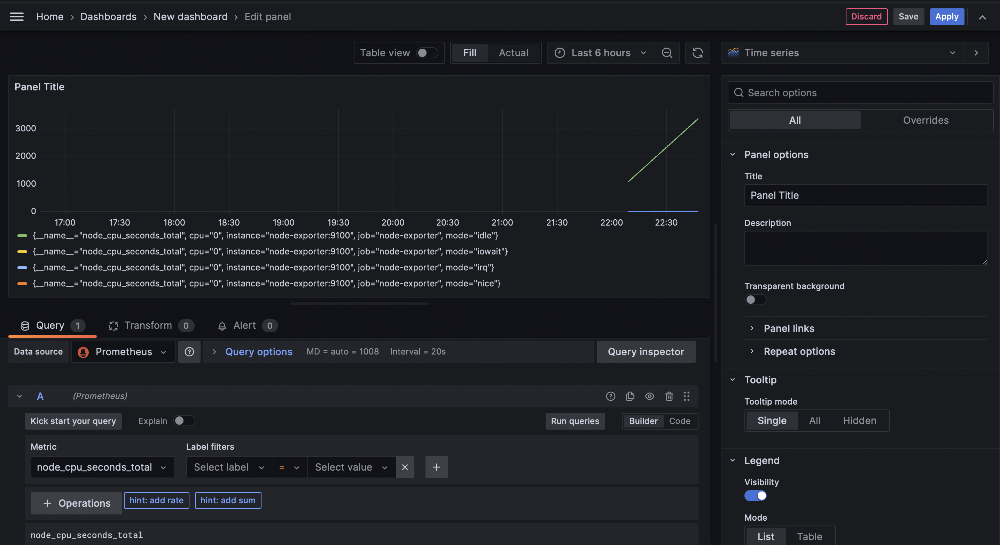

Создала график для памяти

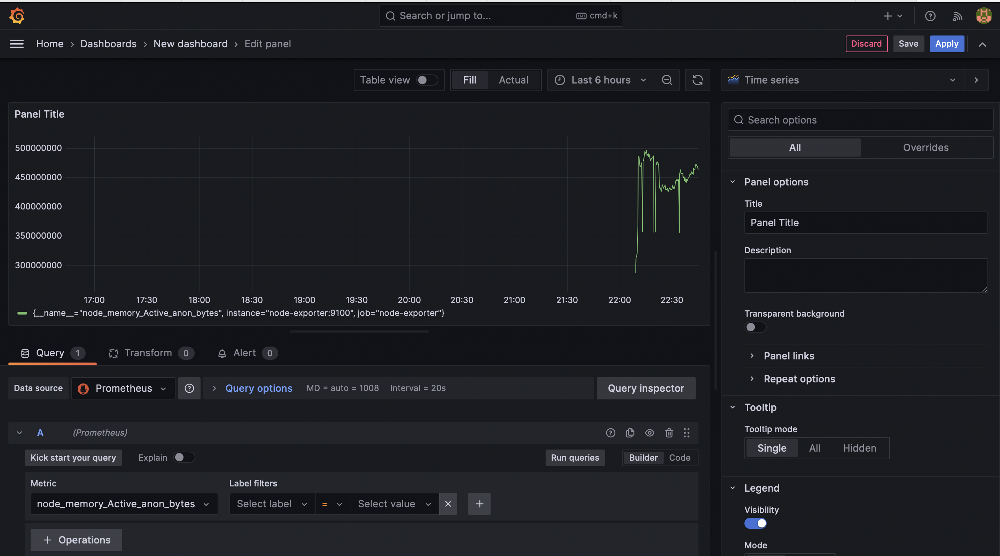

Создала график для диска

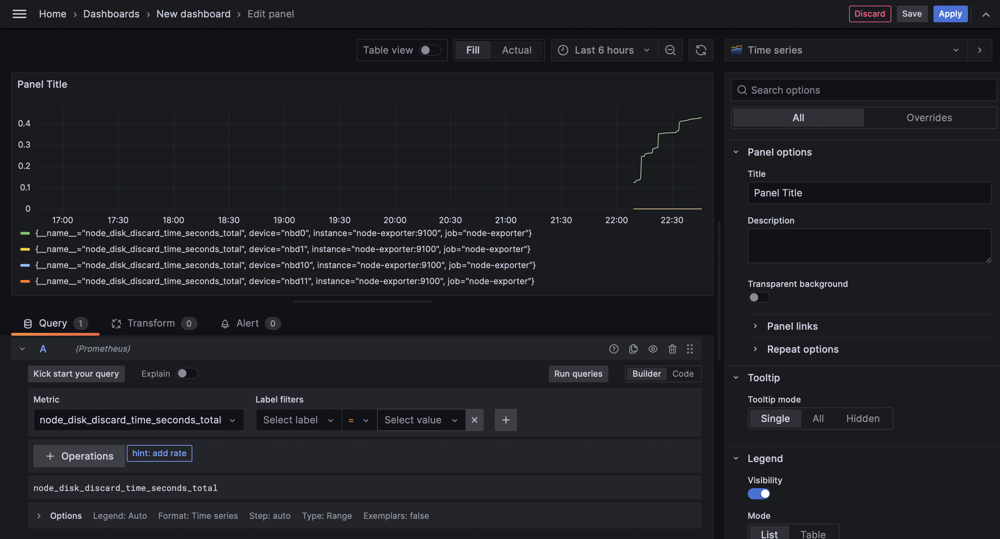

