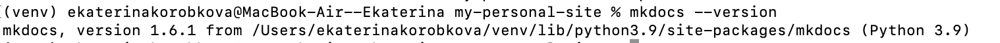
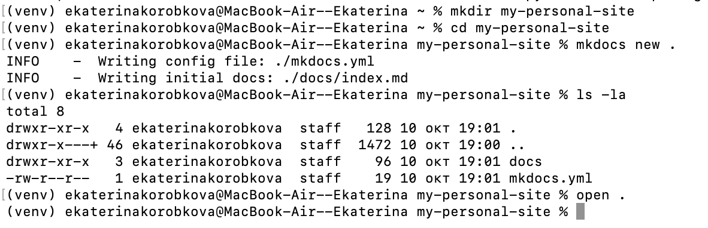
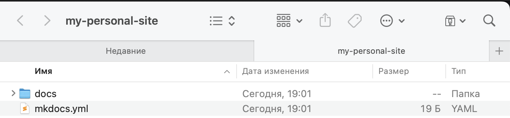
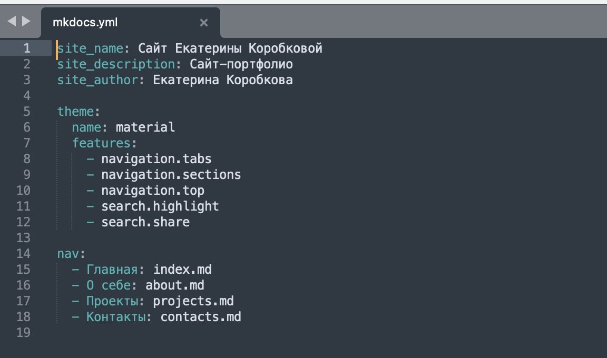
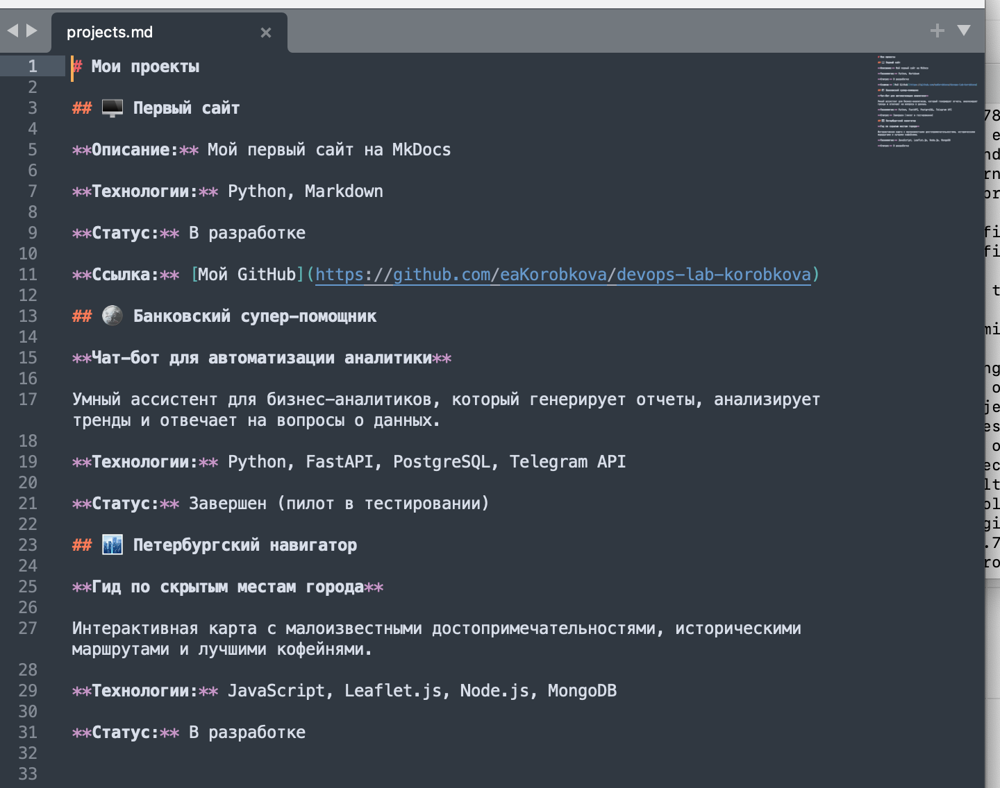
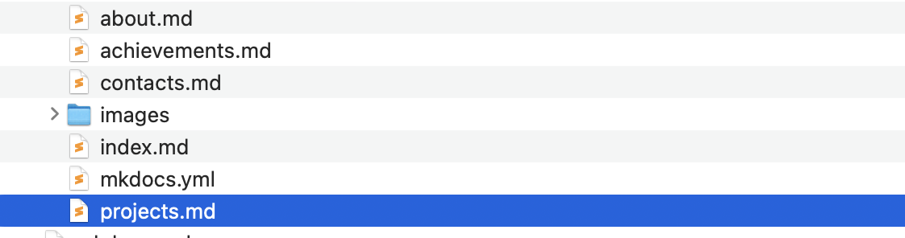
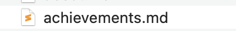
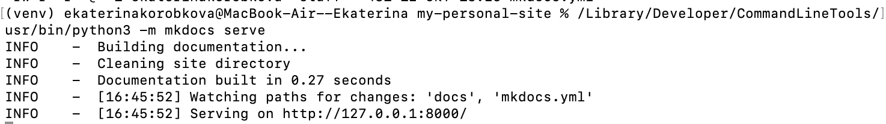
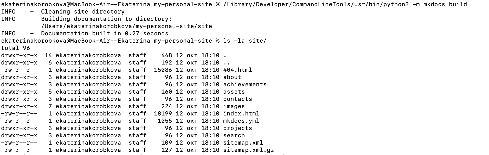

University: ITMO University

Faculty: FICT

Course: Cloud platforms as the basis of technology entrepreneurship ADD link

Year: 2025/2026

Group: U4225

Author: KOROBKOVA EKATERINA ANDREEVNA

Lab: Курсовая работа

Date of create: 12.10.2025

Date of finished: 16.10.2025

**Этап 1: Подготовка и установка**

Установила MkDocs, проверила версию Python, установила MkDocs,установила тему Material,проверила установку: mkdocs --version

Создание нового проекта:

Создала новую папку для проекта: mkdir my-personal-site
Перешла в папку: cd my-personal-site
Инициализировала MkDocs проект: mkdocs new .
Изучила созданную структуру файлов

**Этап 2: Настройка конфигурации**

Настроить базовые параметры файла mkdocs.yml:

Добавила тему Material: yaml theme: name: material features: - navigation.tabs - navigation.sections - navigation.top - search.highlight - search.share

Создала структуру навигации в mkdocs.yml

Добавила  разделы: Главная, О себе, Проекты, Контакты

**Этап 3: Создание контента**

Создала и заполнила страницы: Главная страница (index.md),Страница "О себе" (about.md), Страница "Проекты" (projects.md), Страница "Контакты" (contacts.md)

**Этап 4: Дополнительные возможности**

Добавление изображений:

Создала папку docs/images/

Добавила мое фото или логотип

Использовала изображения в контенте

Настройка поиска:

Убедилась, что поиск включен в конфигурации

Протестировала функциональность поиска

Добавление дополнительных страниц:

Добавить страницу с достижениями

**Этап 5: Стилизация и кастомизация**

Настроила цветовую схему:

Выбрала цветовую палитру в mkdocs.yml

Настроила primary и accent цвета

Добавила логотип

Добавила фавикон

Настройка футера:

Добавила информацию в футер

Включила ссылку на социальные сети

**Этап 6: Тестирование и публикация**

Локальное тестирование:

Запустила локальный сервер: mkdocs serve

Проверила все страницы и ссылки

Убедиться в корректности отображения

Сборка сайта:

Создала статические файлы: mkdocs build

Проверила содержимое папки site/

Публикация:

https://eakorobkova.github.io/devops-lab-korobkova/
